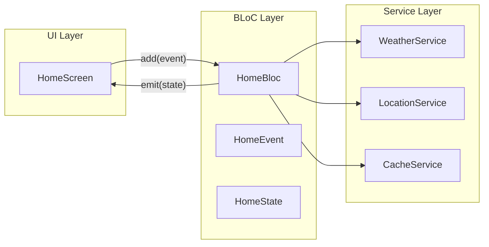

# Walkthrough: Home Screen BLoC Refactor

## Summary

Berhasil melakukan refactoring Home Screen dari `setState` (ephemeral state) menjadi `flutter_bloc` pattern untuk memisahkan business logic dari UI.

---

## Changes Made

### New Files Created

| File | Purpose |
|------|---------|
| [home_event.dart](file:///c:/Users/affan/OneDrive/Dokumen/Petani/petani_maju/lib/features/home/bloc/home_event.dart) | Events: `LoadHomeData`, `RefreshHomeData` |
| [home_state.dart](file:///c:/Users/affan/OneDrive/Dokumen/Petani/petani_maju/lib/features/home/bloc/home_state.dart) | States: `HomeInitial`, `HomeLoading`, `HomeLoaded`, `HomeError` |
| [home_bloc.dart](file:///c:/Users/affan/OneDrive/Dokumen/Petani/petani_maju/lib/features/home/bloc/home_bloc.dart) | BLoC with all business logic |

---

### Modified Files

#### [pubspec.yaml](file:///c:/Users/affan/OneDrive/Dokumen/Petani/petani_maju/pubspec.yaml)

render_diffs(file:///c:/Users/affan/OneDrive/Dokumen/Petani/petani_maju/pubspec.yaml)

---

#### [home_screen.dart](file:///c:/Users/affan/OneDrive/Dokumen/Petani/petani_maju/lib/features/home/screens/home_screen.dart)

**Perubahan utama:**
- **Removed**: Semua variabel state lokal (`isLoading`, `currentWeather`, `forecastList`, dll)
- **Removed**: Semua fungsi logic (`_loadData()`, `_fetchData()`, `_generateRecommendation()`, dll)
- **Added**: `BlocConsumer<HomeBloc, HomeState>` dengan:
  - `BlocListener`: Handle notifications dan snackbar
  - `BlocBuilder`: Render UI berdasarkan state

---

#### [navbaar.dart](file:///c:/Users/affan/OneDrive/Dokumen/Petani/petani_maju/lib/widgets/navbaar.dart)

render_diffs(file:///c:/Users/affan/OneDrive/Dokumen/Petani/petani_maju/lib/widgets/navbaar.dart)

---

## Architecture



---

## Verification Results

| Check | Status |
|-------|--------|
| `flutter pub get` | ✅ Success |
| `flutter analyze` | ✅ No errors (22 pre-existing info warnings) |

> [!NOTE]
> Manual testing (run app, pull-to-refresh, offline mode) harus dilakukan oleh user.

---

## How to Use

### Di screen lain yang butuh Home data:

```dart
context.read<HomeBloc>().add(LoadHomeData());
```

### Untuk pull-to-refresh:

```dart
context.read<HomeBloc>().add(RefreshHomeData());
```

### Untuk access current state:

```dart
final state = context.read<HomeBloc>().state;
if (state is HomeLoaded) {
  print(state.currentWeather);
}
```
