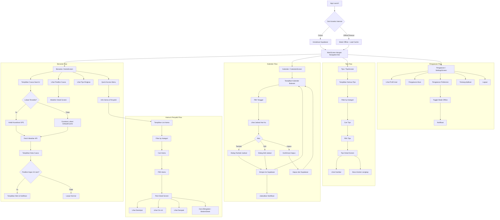
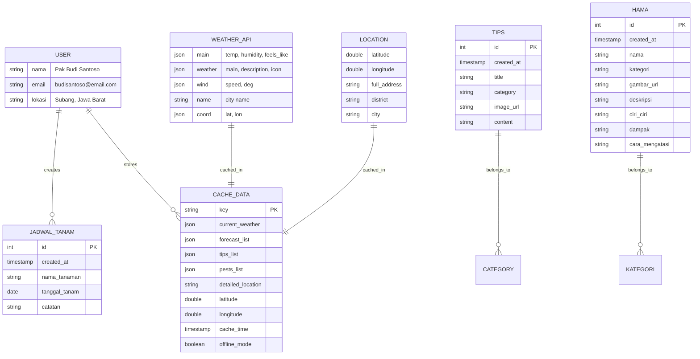
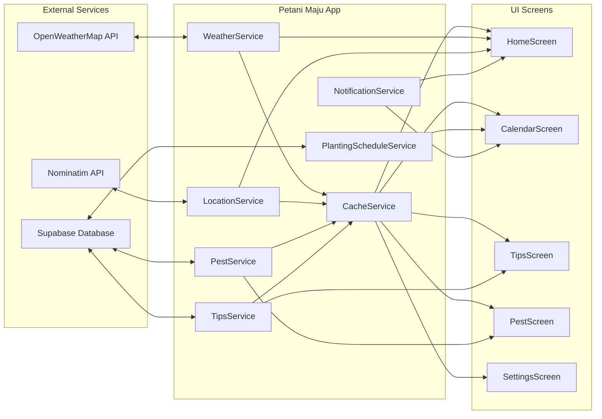
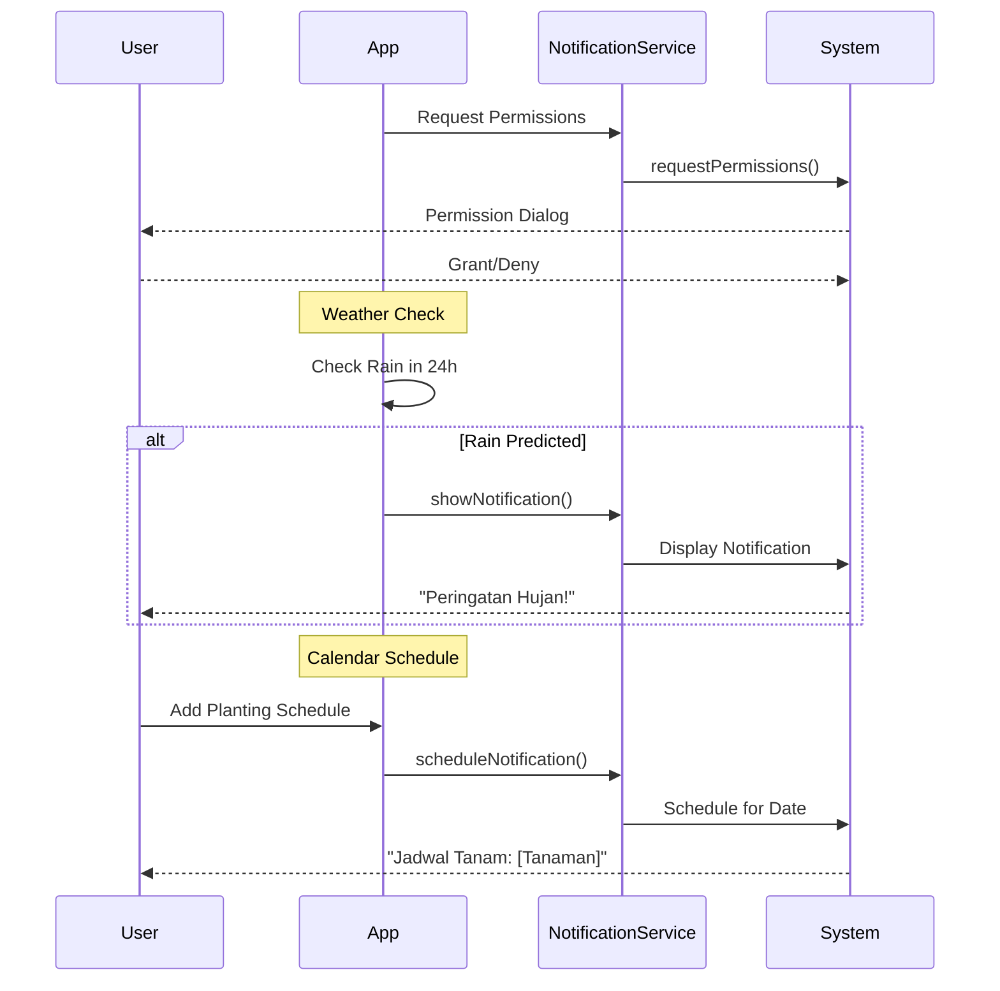

# Petani Maju - Dokumentasi User Flow & ERD

Dokumentasi lengkap mengenai alur pengguna (User Flow) dan Entity Relationship Diagram (ERD) untuk aplikasi Petani Maju.

---

## 📱 Gambaran Umum Aplikasi

**Petani Maju** adalah aplikasi mobile berbasis Flutter yang dirancang untuk membantu petani Indonesia dengan fitur:
- Informasi cuaca real-time berdasarkan lokasi
- Kalender perencanaan jadwal tanam
- Tips pertanian dari berbagai kategori
- Informasi hama & penyakit tanaman
- Mode offline dengan caching lokal

---

## 🔄 User Flow Diagram



---

## 📊 Entity Relationship Diagram (ERD)



---

## 🗂️ Struktur Data & Relasi

### 1. Tabel Supabase

#### `jadwal_tanam` (Planting Schedule)
| Kolom | Tipe | Deskripsi |
|-------|------|-----------|
| `id` | int | Primary Key, auto-increment |
| `created_at` | timestamp | Waktu pembuatan record |
| `nama_tanaman` | string | Nama tanaman (e.g., "Padi", "Jagung") |
| `tanggal_tanam` | date | Tanggal jadwal tanam |
| `catatan` | string | Catatan tambahan (opsional) |

#### `tips` (Farming Tips)
| Kolom | Tipe | Deskripsi |
|-------|------|-----------|
| `id` | int | Primary Key |
| `created_at` | timestamp | Waktu pembuatan |
| `title` | string | Judul tips |
| `category` | string | Kategori (Padi, Jagung, Nutrisi, dll) |
| `image_url` | string | URL gambar ilustrasi |
| `content` | text | Konten lengkap tips |

#### `hama` (Pests & Diseases)
| Kolom | Tipe | Deskripsi |
|-------|------|-----------|
| `id` | int | Primary Key |
| `created_at` | timestamp | Waktu pembuatan |
| `nama` | string | Nama hama/penyakit |
| `kategori` | string | Kategori (Hama Padi, Hama Jagung, Hama Umum) |
| `gambar_url` | string | URL gambar hama |
| `deskripsi` | text | Deskripsi umum |
| `ciri_ciri` | text | Ciri-ciri hama/penyakit |
| `dampak` | text | Dampak (dipisahkan dengan `\n`) |
| `cara_mengatasi` | text | Solusi penanganan |

---

### 2. External API

#### OpenWeatherMap API
**Endpoints yang digunakan:**
- `GET /weather` - Current weather data
- `GET /forecast` - 5-day/3-hour forecast

**Response Structure:**
```json
{
  "main": {
    "temp": 28.5,
    "feels_like": 32.1,
    "humidity": 80
  },
  "weather": [{
    "main": "Rain",
    "description": "light rain",
    "icon": "10d"
  }],
  "wind": {
    "speed": 3.5
  },
  "name": "Subang"
}
```

#### Nominatim (OpenStreetMap) - Location Service
**Endpoint:** Reverse Geocoding
**Response:** Detailed address from coordinates

---

### 3. Local Cache (Hive)

| Key | Tipe Data | Deskripsi |
|-----|-----------|-----------|
| `current_weather` | Map | Data cuaca saat ini |
| `forecast` | List | Data prediksi cuaca |
| `tips` | List | Data tips pertanian |
| `pests` | List | Data hama & penyakit |
| `detailed_location` | String | Alamat lengkap |
| `latitude` | double | Koordinat latitude |
| `longitude` | double | Koordinat longitude |
| `cache_time` | DateTime | Waktu cache disimpan |
| `offline_mode` | bool | Status mode offline |

---

## 🔗 Alur Data & Integrasi



---

## 📲 Alur Navigasi Detail

### 1. Startup Flow
```
main.dart
├── Load .env
├── Initialize Hive (CacheService)
├── Initialize Notifications
├── Initialize Supabase (with 10s timeout)
│   ├── Success → Online Mode
│   └── Timeout/Error → Offline Mode
└── Run MainApp → MainScreen (NavBar)
```

### 2. Home Screen Flow
```
HomeScreen
├── Load Cache First (instant display)
├── Check Location Permission
│   ├── Granted → Get Current Position
│   └── Denied → Use Default/Cached Location
├── Fetch Weather Data
│   ├── Current Weather → Display Main Card
│   └── Forecast → Display Hourly List
├── Check Rain Prediction (24h)
│   └── If Rain → Show Alert + Push Notification
├── Display Tips List (from cache/API)
└── Quick Access Menu
    ├── Info Hama → PestScreen
    └── Weather Card → WeatherDetailScreen
```

### 3. Calendar Screen Flow
```
CalendarScreen
├── Load Schedules from Supabase
├── Display Calendar (TableCalendar)
├── Select Day → Show Events for Day
└── Actions:
    ├── Add (FAB) → Schedule Dialog
    │   ├── Input: Nama Tanaman, Catatan
    │   ├── Save to Supabase
    │   └── Schedule Notification
    ├── Edit (Icon) → Edit Dialog
    │   └── Update in Supabase
    └── Delete (Icon) → Confirm Dialog
        └── Delete from Supabase
```

### 4. Tips Screen Flow
```
TipsScreen
├── Load from Cache
├── Fetch from Supabase (if online)
├── Display Grid of Tips
├── Category Filter (Semua, Padi, Jagung, Nutrisi)
├── Search Bar
└── Tap Card → TipsDetailScreen
    ├── Hero Image
    ├── Category Badge
    ├── Title
    └── Full Content
```

### 5. Pest Screen Flow
```
PestScreen
├── Load from Cache
├── Fetch from Supabase (if online)
├── Display List of Pests
├── Category Filter (Semua, Hama Padi, Hama Jagung, Hama Umum)
├── Search Bar (debounced)
└── Tap Card → PestDetailScreen
    ├── Image
    ├── Category Badge
    ├── Description
    ├── Characteristics
    ├── Impact (bullet points)
    └── Solution Button → BottomSheet
```

### 6. Settings Screen Flow
```
SettingsScreen
├── User Profile Section
├── Account Settings
│   ├── My Profile
│   └── Location
├── Preferences
│   ├── Notifications
│   ├── Language
│   └── Offline Mode Toggle
├── About
│   ├── Help & Support
│   ├── Terms & Conditions
│   └── About App (v1.0.0)
└── Logout Button
```

---

## 🔔 Notification Flow



---

## 📁 Struktur Folder Proyek

```
lib/
├── main.dart                    # Entry point
├── core/
│   ├── constants/
│   │   └── colors.dart          # App color palette
│   ├── services/
│   │   ├── cache_service.dart   # Hive caching
│   │   └── notification_service.dart  # Local notifications
│   └── theme/
├── data/
│   └── datasources/
│       ├── weather_service.dart      # OpenWeatherMap API
│       ├── location_service.dart     # Nominatim API
│       ├── tips_services.dart        # Supabase tips
│       ├── pest_services.dart        # Supabase hama
│       └── planting_schedule_service.dart  # Supabase jadwal
├── features/
│   ├── home/
│   │   ├── screens/home_screen.dart
│   │   └── widgets/
│   │       ├── forecast_list.dart
│   │       ├── quick_access.dart
│   │       ├── tips_list.dart
│   │       └── weather_alert.dart
│   ├── calendar/
│   │   └── screens/calendar_screen.dart
│   ├── tips/
│   │   └── screens/
│   │       ├── tips_screen.dart
│   │       └── tips_detail_screen.dart
│   ├── pests/
│   │   └── screens/
│   │       ├── pest_screen.dart
│   │       └── pest_detail_screen.dart
│   ├── weather/
│   │   └── screens/weather_detail_screen.dart
│   └── settings/
│       └── screens/settings_screen.dart
├── utils/
│   └── weather_utils.dart        # Weather translation
└── widgets/
    ├── navbaar.dart              # Bottom Navigation
    ├── custom_app_bar.dart
    ├── main_weather_card.dart
    └── section_header.dart
```

---

## ✅ Ringkasan

Aplikasi **Petani Maju** menggunakan arsitektur yang terstruktur dengan:

1. **4 Tab Utama**: Beranda, Kalender, Tips, Pengaturan
2. **3 Tabel Supabase**: `jadwal_tanam`, `tips`, `hama`
3. **2 External API**: OpenWeatherMap, Nominatim
4. **1 Local Cache**: Hive untuk mode offline
5. **Notifikasi**: Weather alerts & schedule reminders

Relasi data bersifat **loosely coupled** dimana setiap entitas independen dan data di-cache secara lokal untuk mendukung penggunaan offline.
