# 📱 Panduan Penggunaan Aplikasi Petani Maju

**Dokumentasi Lengkap Perangkat Lunak**

---

## 📑 Daftar Isi

1. [Latar Belakang & Analisis Masalah](#-latar-belakang--analisis-masalah)
2. [Inovasi & Proposisi Nilai](#-inovasi--proposisi-nilai)
3. [Deskripsi Fungsional & Detail Fitur](#-deskripsi-fungsional--detail-fitur)
4. [Arsitektur & Teknologi](#-arsitektur--teknologi)
5. [Screenshot Implementasi MVP](#-screenshot-implementasi-mvp)
6. [Keamanan & Privasi](#-keamanan--privasi)
7. [Skalabilitas & Rencana Pengembangan](#-skalabilitas--rencana-pengembangan)

---

## 🔍 Latar Belakang & Analisis Masalah

### Kondisi Pertanian Indonesia

Indonesia merupakan negara agraris dengan sektor pertanian yang menjadi tulang punggung ekonomi nasional. Namun, petani Indonesia menghadapi berbagai tantangan signifikan:

| Masalah | Statistik | Dampak |
|---------|-----------|--------|
| **Cuaca Tidak Menentu** | 75% petani mengalami kerugian akibat perubahan cuaca ekstrem | Gagal panen, kerugian finansial |
| **Akses Informasi Terbatas** | 60% petani di pedesaan belum memiliki akses informasi pertanian yang memadai | Teknik budidaya tidak optimal |
| **Serangan Hama** | Kerugian nasional Rp 3-5 Triliun/tahun akibat hama wereng | Penurunan produktivitas signifikan |
| **Perencanaan Tidak Terstruktur** | 70% petani tradisional tidak memiliki jadwal tanam terencana | Waktu tanam tidak optimal |
| **Ketergantungan Cuaca** | 90% lahan pertanian bergantung pada hujan | Risiko kekeringan tinggi |

### Identifikasi Masalah Utama

```mermaid
flowchart TD
    A[Masalah Petani Indonesia] --> B[Akses Informasi Cuaca Terbatas]
    A --> C[Tidak Ada Sistem Peringatan Dini]
    A --> D[Manajemen Jadwal Tanam Manual]
    A --> E[Kurangnya Edukasi Pertanian Modern]
    A --> F[Penanganan Hama Reaktif]
    
    B --> G[🌧️ Kerugian Panen]
    C --> G
    D --> H[📅 Waktu Tanam Tidak Optimal]
    E --> I[📚 Produktivitas Rendah]
    F --> I
```



### Kebutuhan Solusi Digital

Berdasarkan analisis di atas, dibutuhkan solusi digital yang:
- ✅ Menyediakan informasi cuaca **real-time** berbasis lokasi
- ✅ Memberikan **peringatan dini** untuk kondisi cuaca ekstrem
- ✅ Membantu **perencanaan jadwal tanam** yang terstruktur
- ✅ Menyediakan **edukasi pertanian** yang komprehensif
- ✅ Dapat diakses **offline** di daerah dengan sinyal terbatas

---

## 💡 Inovasi & Proposisi Nilai

### Value Proposition

**"Petani Maju - Solusi Digital Cerdas untuk Pertanian Indonesia Modern"**

| Inovasi | Keunggulan | Dampak |
|---------|------------|--------|
| **Cuaca Real-Time** | Data langsung dari OpenWeatherMap API | Keputusan tanam lebih akurat |
| **Notifikasi Pintar** | Alert cuaca ekstrem otomatis | Antisipasi dini, minimalisir kerugian |
| **Kalender Digital** | Penjadwalan aktivitas pertanian | Manajemen waktu lebih efisien |
| **Offline-First** | App tetap berfungsi tanpa internet | Akses di daerah terpencil |
| **Multi-Bahasa** | Dukungan Indonesia & Inggris | Jangkauan pengguna lebih luas |

### Keunggulan Kompetitif


### Target Pengguna

1. **Petani Modern** - Yang ingin digitalisasi proses pertanian
2. **Petani Tradisional** - Yang membutuhkan bantuan informasi cuaca
3. **Penyuluh Pertanian** - Yang membutuhkan alat bantu edukasi
4. **Mahasiswa Pertanian** - Yang belajar teknik budidaya modern

---

## 📋 Deskripsi Fungsional & Detail Fitur

### 1. 🌤️ Sistem Cuaca Cerdas

**Fitur Utama:**
- **Real-time Weather**: Informasi cuaca terkini dengan akurasi tinggi
- **Forecast 5 Hari**: Prediksi cuaca hingga 5 hari ke depan
- **Hourly Forecast**: Detail prakiraan per jam selama 24 jam
- **Weather Alerts**: Notifikasi otomatis untuk kondisi ekstrem

**Cara Penggunaan:**
1. Buka aplikasi Petani Maju
2. Izinkan akses lokasi saat pertama kali
3. Cuaca akan tampil otomatis di halaman utama
4. Geser kartu cuaca ke kiri/kanan untuk melihat prakiraan jam berikutnya
5. Klik "Lihat Detail" untuk informasi lengkap

**Jenis Alert Cuaca:**
| Kondisi | Ikon | Penjelasan |
|---------|------|------------|
| Hujan Deras | 🌧️ | Intensitas hujan > 10mm/jam |
| Angin Kencang | 💨 | Kecepatan angin > 40 km/jam |
| Badai Petir | ⛈️ | Kondisi thunderstorm terdeteksi |
| Suhu Ekstrem | 🌡️ | Suhu > 35°C atau < 15°C |

---

### 2. 📅 Kalender Tanam Digital

**Fitur Utama:**
- **Manajemen Jadwal**: Tambah, edit, hapus kegiatan pertanian
- **Notifikasi Pengingat**: Reminder H-1 dan hari H
- **Rekomendasi Bulanan**: Saran aktivitas berdasarkan musim

**Cara Penggunaan:**
1. Pilih menu **Kalender** di navigasi bawah
2. Klik tanggal yang diinginkan
3. Tekan tombol (+) untuk menambah kegiatan baru
4. Isi detail kegiatan:
   - Nama aktivitas (contoh: "Tanam Padi")
   - Waktu pelaksanaan
   - Catatan tambahan
5. Simpan jadwal

**Alur Notifikasi Kalender:**
```
Jadwal Dibuat
     │
     ├── H-1: Notifikasi Pengingat
     │       "Besok: [Nama Aktivitas]"
     │
     ├── H-1 Jam: Reminder 1 jam sebelum
     │       "1 jam lagi: [Nama Aktivitas]"
     │
     └── Hari H: Notifikasi hari ini
             "Hari ini: [Nama Aktivitas]"
```

---

### 3. 📚 Tips & Edukasi Pertanian

**Fitur Utama:**
- **Kategori Lengkap**: Padi, Jagung, Nutrisi Tanaman, dll
- **Filter Kategori**: Cari tips sesuai kebutuhan
- **Offline Reading**: Baca kapan saja tanpa internet

**Cara Penggunaan:**
1. Pilih menu **Tips** di navigasi bawah
2. Lihat daftar tips yang tersedia
3. Gunakan filter untuk menyaring berdasarkan kategori
4. Klik artikel untuk membaca detail

**Kategori Tips Tersedia:**
- 🌾 Budidaya Padi
- 🌽 Budidaya Jagung
- 🧪 Nutrisi Tanaman
- 💧 Irigasi & Pengairan
- 🔧 Teknik Modern

---

### 4. 🐛 Informasi Hama & Penyakit

**Fitur Utama:**
- **Daftar Hama Lengkap**: Informasi hama umum di Indonesia
- **Gejala & Penanganan**: Cara identifikasi dan solusi
- **Pencarian Cepat**: Cari hama berdasarkan nama

**Cara Penggunaan:**
1. Klik menu **Hama** di Quick Access (halaman utama)
2. Browse daftar hama atau gunakan pencarian
3. Klik untuk melihat detail:
   - Deskripsi hama
   - Gejala serangan
   - Cara penanganan
   - Pencegahan

---

### 5. 🔔 Sistem Notifikasi Pintar

**Fitur Utama:**
- **Morning Briefing**: Sapaan pagi dengan info cuaca (06:00)
- **Weather Alerts**: Peringatan cuaca ekstrem otomatis
- **Schedule Reminders**: Pengingat jadwal tanam
- **Quiet Mode**: Mode tenang malam hari (22:00-05:00)

**Cara Pengaktifan:**
1. Buka menu **Pengaturan** → **Notifikasi**
2. Aktifkan/nonaktifkan sesuai kebutuhan:
   - ✅ Morning Briefing
   - ✅ Weather Alerts
   - ✅ Calendar Reminders
3. Pengaturan langsung aktif

---

### 6. ⚙️ Pengaturan & Personalisasi

**Fitur Tersedia:**
| Menu | Fungsi |
|------|--------|
| **Profil** | Edit nama & foto profil |
| **Bahasa** | Pilih Indonesia/English |
| **Notifikasi** | Kelola preferensi notifikasi |
| **Bantuan** | Hubungi support via email |
| **Tentang** | Info versi aplikasi |

---

## 🏗️ Arsitektur & Teknologi

### Arsitektur Aplikasi

Aplikasi Petani Maju menggunakan arsitektur **Clean Architecture** dengan **BLoC Pattern** untuk pemisahan concern yang jelas:

```
┌─────────────────────────────────────────────────────┐
│                   PRESENTATION                       │
│     (Screens, Widgets, UI Components)                │
├─────────────────────────────────────────────────────┤
│                   BUSINESS LOGIC                     │
│              (BLoC, State Management)                │
├─────────────────────────────────────────────────────┤
│                    DATA LAYER                        │
│      (Repositories, Datasources, Services)           │
├─────────────────────────────────────────────────────┤
│                 EXTERNAL SOURCES                     │
│   (APIs, Supabase, Hive Local DB, GPS)              │
└─────────────────────────────────────────────────────┘
```

### Technology Stack

| Komponen | Teknologi | Justifikasi |
|----------|-----------|-------------|
| **Framework** | Flutter 3.x (Dart) | Cross-platform, performa native |
| **State Management** | BLoC Pattern | Predictable state, testable, scalable |
| **Backend** | Supabase (PostgreSQL) | Realtime database, open source alternative to Firebase |
| **Weather API** | OpenWeatherMap | Akurasi tinggi, coverage global, free tier generous |
| **Local Database** | Hive (NoSQL) | Fast, lightweight, offline-first support |
| **Secure Storage** | Flutter Secure Storage | Enkripsi data sensitif |
| **Background Tasks** | Workmanager | Reliable background processing |
| **Notifications** | Flutter Local Notifications | Full-featured, reliable |
| **Localization** | Easy Localization | Simple, JSON-based translations |
| **Caching** | CachedNetworkImage | Efficient image caching |

### Alur Data (Offline-First Approach)


### Struktur Folder

```
lib/
├── core/                    # Konfigurasi & Services
│   ├── services/            # NotificationService, CacheService
│   ├── constants/           # Colors, API Keys
│   └── theme/               # App Themes
│
├── data/                    # Data Layer
│   ├── datasources/         # API calls
│   ├── repositories/        # Data mediation
│   └── models/              # Data classes
│
├── features/                # Feature Modules
│   ├── home/                # Home Screen & Widgets
│   ├── calendar/            # Calendar Feature
│   ├── tips/                # Tips & Education
│   ├── pests/               # Pest Information
│   ├── weather/             # Weather Details
│   ├── settings/            # User Settings
│   ├── onboarding/          # First-time User Guide
│   └── notifications/       # Notification Center
│
├── logic/                   # Global BLoCs
│   └── app_lifecycle/       # AppBloc for app state
│
├── widgets/                 # Reusable Components
│   ├── custom_app_bar.dart
│   ├── main_weather_card.dart
│   ├── navbaar.dart
│   └── skeleton_container.dart
│
└── main.dart                # Entry Point & DI Setup
```

---

## 📸 Screenshot Implementasi MVP

### Panduan Navigasi Aplikasi

Berikut adalah alur penggunaan utama aplikasi Petani Maju:

**1. Onboarding Screen (First-time User)**
- Tampilan selamat datang untuk pengguna baru
- Panduan singkat fitur-fitur utama
- Geser untuk melihat penjelasan setiap fitur

**2. Home Screen (Halaman Utama)**
- Kartu cuaca utama dengan kondisi terkini
- Forecast per jam (geser horizontal)
- Quick Access ke fitur lainnya
- Peringatan cuaca jika ada kondisi ekstrem

**3. Calendar Screen (Kalender Tanam)**
- Tampilan kalender bulanan
- Daftar kegiatan per tanggal
- Floating action button untuk tambah jadwal

**4. Tips Screen (Tips Pertanian)**
- Grid view artikel tips
- Filter berdasarkan kategori
- Detail artikel dengan gambar

**5. Settings Screen (Pengaturan)**
- Profil pengguna
- Pengaturan notifikasi
- Pilihan bahasa
- Bantuan & dukungan

> **Note**: Untuk screenshot detail, silakan jalankan aplikasi dengan perintah `flutter run` dan akses setiap fitur secara langsung.

---

## 🔒 Keamanan & Privasi

### Prinsip Keamanan

Aplikasi Petani Maju dibangun dengan prinsip **Security by Design**:

| Aspek | Implementasi | Detail |
|-------|--------------|--------|
| **Data Encryption** | Flutter Secure Storage | Semua data sensitif dienkripsi dengan AES-256 |
| **API Keys Protection** | .env file | Kredensial tidak di-hardcode dalam source code |
| **Local Data Security** | Hive Encryption | Cache lokal terenkripsi |
| **Network Security** | HTTPS Only | Semua komunikasi API melalui HTTPS |
| **Permission Minimal** | Only Required | Hanya meminta izin yang diperlukan |

### Izin yang Diperlukan

| Izin | Tujuan | Kapan Diminta |
|------|--------|---------------|
| **Location** | Mendapatkan cuaca berdasarkan lokasi | Saat pertama kali buka app |
| **Notification** | Mengirim peringatan cuaca & reminder | Saat pertama kali buka app |
| **Internet** | Mengambil data cuaca & tips | Otomatis (tidak perlu konfirmasi) |

### Kebijakan Privasi

1. **Data Lokasi**
   - Hanya digunakan untuk mengambil data cuaca
   - Disimpan lokal, TIDAK dikirim ke server pihak ketiga
   - Dapat dihapus melalui menu Pengaturan

2. **Data Profil**
   - Nama dan foto HANYA tersimpan lokal di perangkat
   - TIDAK di-upload ke cloud
   - Dapat dihapus kapan saja

3. **Data Penggunaan**
   - TIDAK melakukan tracking pengguna
   - TIDAK mengumpulkan analytics
   - TIDAK menjual data ke pihak ketiga

### Keamanan Notifikasi

```
Notifikasi di-schedule lokal
         │
         ├── Quiet Mode (22:00-05:00)
         │   └── Notifikasi ditunda sampai pagi
         │
         └── Tersimpan di Notification History
             └── Data terenkripsi di Hive
```

---

## 🚀 Skalabilitas & Rencana Pengembangan

### Roadmap Pengembangan


### Fitur Mendatang

| Versi | Fitur | Deskripsi |
|-------|-------|-----------|
| **v0.6.0** | AI Pest Detection | Deteksi hama via foto menggunakan ML |
| **v0.7.0** | Marketplace | Integrasi jual-beli hasil tani |
| **v0.8.0** | Community Forum | Diskusi sesama petani |
| **v0.9.0** | IoT Integration | Koneksi dengan sensor pertanian |
| **v1.0.0** | Full Production | Rilis resmi ke Play Store/App Store |

### Strategi Skalabilitas

**1. Arsitektur Scalable**
- BLoC Pattern memungkinkan penambahan fitur tanpa mengubah struktur existing
- Feature-first organization mempermudah modularisasi
- Repository pattern memisahkan logika data dari UI

**2. Backend Scalability**
- Supabase mendukung horizontal scaling
- PostgreSQL dapat menangani jutaan records
- CDN untuk asset dan gambar

**3. Offline Capability**
- Hive local database dapat menampung data besar
- Sync mechanism untuk data consistency
- Conflict resolution strategy

**4. Performance Optimization**
- Lazy loading untuk daftar panjang
- Image caching dengan CachedNetworkImage
- Background task optimization

### Metrik Kesuksesan

| Metrik | Target | Pengukuran |
|--------|--------|------------|
| **Instalasi** | 10,000+ | Play Store Analytics |
| **Retensi 7 Hari** | > 40% | User tracking |
| **Rating** | > 4.5 ⭐ | Play Store Rating |
| **Crash Rate** | < 0.5% | Firebase Crashlytics |
| **Notifikasi CTR** | > 25% | Internal analytics |

---

## 📞 Tim Pengembang

| Nama | NIM | Role |
|------|-----|------|
| Adam Raga | A11.2024.15598 | Developer |
| Affan Shahzada | A11.2024.15784 | Developer |
| Aiska Zahra Nailani | A11.2024.16014 | Developer |
| Nur Alif Maulana | A11.2024.15936 | Developer |

---

## 📄 Referensi

1. Flutter Documentation - https://flutter.dev/docs
2. BLoC Pattern - https://bloclibrary.dev
3. Supabase Documentation - https://supabase.io/docs
4. OpenWeatherMap API - https://openweathermap.org/api

---

*Dokumentasi ini dibuat untuk Capstone Project - Program Studi Teknik Informatika*

*Terakhir diperbarui: 17 Januari 2026*
