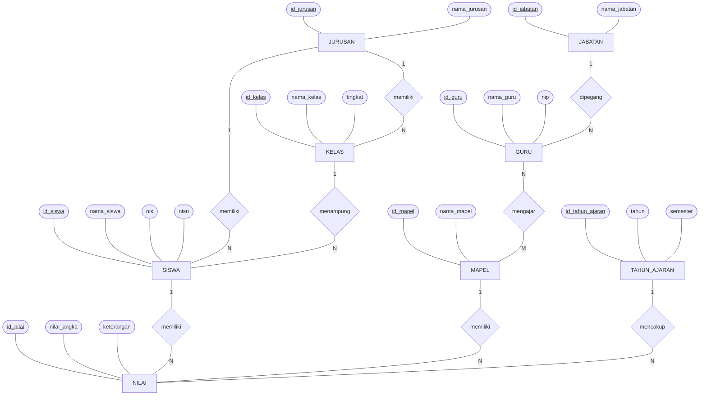

```mermaid
flowchart TD
    %% Entities
    JURUSAN[JURUSAN]
    KELAS[KELAS]
    SISWA[SISWA]
    JABATAN[JABATAN]
    GURU[GURU]
    MAPEL[MAPEL]
    NILAI[NILAI]
    TAHUN_AJARAN[TAHUN_AJARAN]

    %% Attributes
    JURUSAN_id([<u>id_jurusan</u>]) --- JURUSAN
    JURUSAN_nama([nama_jurusan]) --- JURUSAN

    KELAS_id([<u>id_kelas</u>]) --- KELAS
    KELAS_nama([nama_kelas]) --- KELAS
    KELAS_tingkat([tingkat]) --- KELAS

    SISWA_id([<u>id_siswa</u>]) --- SISWA
    SISWA_nama([nama_siswa]) --- SISWA
    SISWA_nis([nis]) --- SISWA
    SISWA_nisn([nisn]) --- SISWA

    JABATAN_id([<u>id_jabatan</u>]) --- JABATAN
    JABATAN_nama([nama_jabatan]) --- JABATAN

    GURU_id([<u>id_guru</u>]) --- GURU
    GURU_nama([nama_guru]) --- GURU
    GURU_nip([nip]) --- GURU

    MAPEL_id([<u>id_mapel</u>]) --- MAPEL
    MAPEL_nama([nama_mapel]) --- MAPEL

    NILAI_id([<u>id_nilai</u>]) --- NILAI
    NILAI_angka([nilai_angka]) --- NILAI
    NILAI_ket([keterangan]) --- NILAI

    TA_id([<u>id_tahun_ajaran</u>]) --- TAHUN_AJARAN
    TA_tahun([tahun]) --- TAHUN_AJARAN
    TA_sem([semester]) --- TAHUN_AJARAN

    %% Relationships
    REL_memiliki_jur_kelas{memiliki}
    JURUSAN ---|1| REL_memiliki_jur_kelas
    REL_memiliki_jur_kelas ---|N| KELAS

    REL_memiliki_jur_siswa{memiliki}
    JURUSAN ---|1| REL_memiliki_jur_siswa
    REL_memiliki_jur_siswa ---|N| SISWA

    REL_menampung{menampung}
    KELAS ---|1| REL_menampung
    REL_menampung ---|N| SISWA

    REL_dipegang{dipegang}
    JABATAN ---|1| REL_dipegang
    REL_dipegang ---|N| GURU

    REL_mengajar{mengajar}
    GURU ---|N| REL_mengajar
    REL_mengajar ---|M| MAPEL

    REL_memiliki_siswa_nilai{memiliki}
    SISWA ---|1| REL_memiliki_siswa_nilai
    REL_memiliki_siswa_nilai ---|N| NILAI

    REL_memiliki_mapel_nilai{memiliki}
    MAPEL ---|1| REL_memiliki_mapel_nilai
    REL_memiliki_mapel_nilai ---|N| NILAI

    REL_mencakup{mencakup}
    TAHUN_AJARAN ---|1| REL_mencakup
    REL_mencakup ---|N| NILAI
```
