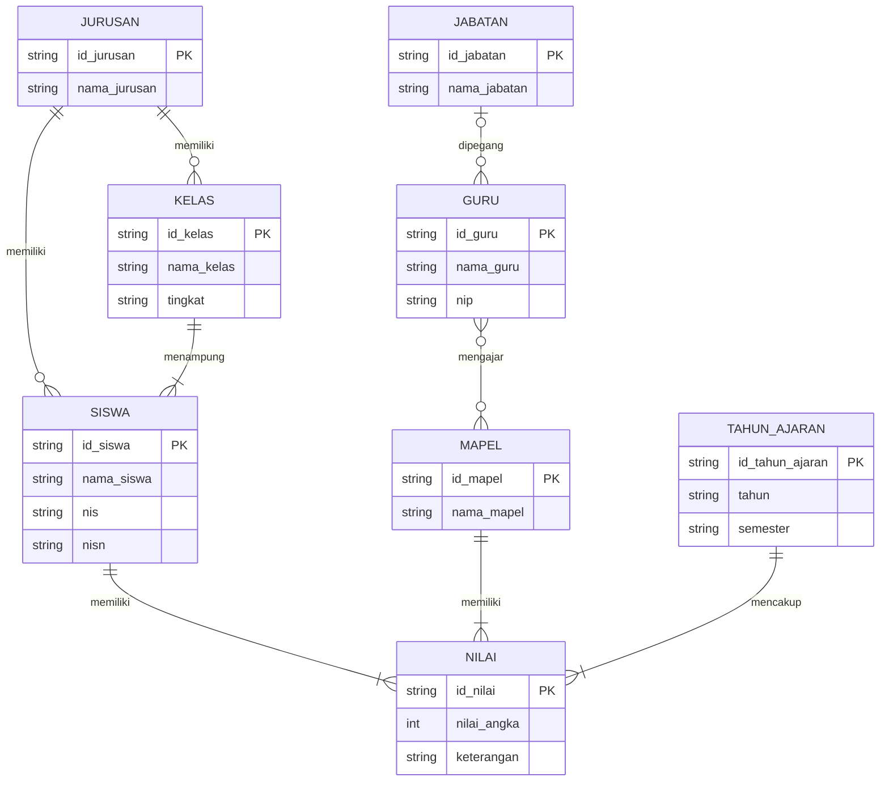

```mermaid
erDiagram
    JURUSAN ||--o{ KELAS : memiliki
    JURUSAN ||--o{ SISWA : memiliki
    KELAS ||--|{ SISWA : menampung
    JABATAN |o--o{ GURU : dipegang
    GURU }o--o{ MAPEL : mengajar
    SISWA ||--|{ NILAI : memiliki
    MAPEL ||--|{ NILAI : memiliki
    TAHUN_AJARAN ||--|{ NILAI : mencakup

    JURUSAN {
        string id_jurusan PK
        string nama_jurusan
    }

    KELAS {
        string id_kelas PK
        string nama_kelas
        string tingkat
    }

    SISWA {
        string id_siswa PK
        string nama_siswa
        string nis
        string nisn
    }

    JABATAN {
        string id_jabatan PK
        string nama_jabatan
    }

    GURU {
        string id_guru PK
        string nama_guru
        string nip
    }

    MAPEL {
        string id_mapel PK
        string nama_mapel
    }

    NILAI {
        string id_nilai PK
        int nilai_angka
        string keterangan
    }

    TAHUN_AJARAN {
        string id_tahun_ajaran PK
        string tahun
        string semester
    }
```
