# 📊 Entity Relationship Diagram - Petani Maju

Dokumentasi lengkap struktur data dan relasi antar entitas dalam aplikasi Petani Maju.

---

## 📋 Daftar Isi

- [ERD Lengkap](#erd-lengkap)
- [Detail Entitas](#detail-entitas)
  - [Supabase Database](#supabase-database)
  - [Local Storage - Hive](#local-storage---hive)
  - [External API](#external-api)
- [Relasi Antar Entitas](#relasi-antar-entitas)
- [Ringkasan Penyimpanan](#ringkasan-penyimpanan)

---

## ERD Lengkap

---

## Detail Entitas

### Supabase Database

#### 📚 TIPS

Tabel untuk menyimpan artikel tips pertanian.

| Kolom | Tipe Data | Constraint | Deskripsi |
|-------|-----------|------------|-----------|
| `id` | INTEGER | PRIMARY KEY | ID unik tips |
| `judul` | VARCHAR | NOT NULL | Judul artikel tips |
| `konten` | TEXT | NOT NULL | Isi artikel lengkap |
| `kategori` | VARCHAR | NOT NULL | Kategori: Padi, Jagung, Nutrisi |
| `gambar_url` | VARCHAR | NULLABLE | URL gambar header |
| `created_at` | TIMESTAMP | DEFAULT NOW | Waktu pembuatan |

---

#### 🐛 HAMA

Tabel untuk menyimpan informasi hama dan penyakit tanaman.

| Kolom | Tipe Data | Constraint | Deskripsi |
|-------|-----------|------------|-----------|
| `id` | INTEGER | PRIMARY KEY | ID unik hama/penyakit |
| `nama` | VARCHAR | NOT NULL | Nama hama/penyakit |
| `jenis` | VARCHAR | NOT NULL | Jenis: hama, penyakit |
| `deskripsi` | TEXT | NOT NULL | Deskripsi lengkap |
| `gejala` | TEXT | NULLABLE | Gejala serangan |
| `pengendalian` | TEXT | NULLABLE | Cara pengendalian |
| `pencegahan` | TEXT | NULLABLE | Cara pencegahan |
| `gambar_url` | VARCHAR | NULLABLE | URL gambar |

---

### Local Storage - Hive

#### 📅 PLANTING_SCHEDULE

Data jadwal tanam yang disimpan lokal.

| Kolom | Tipe Data | Constraint | Deskripsi |
|-------|-----------|------------|-----------|
| `id` | INTEGER | PRIMARY KEY | ID auto-increment dari Hive |
| `nama_tanaman` | STRING | REQUIRED | Nama kegiatan/tanaman |
| `tanggal_tanam` | DATETIME | REQUIRED | Tanggal dan waktu kegiatan |
| `catatan` | STRING | OPTIONAL | Catatan tambahan |

---

#### 👤 USER_PROFILE

Data profil pengguna lokal.

| Kolom | Tipe Data | Constraint | Deskripsi |
|-------|-----------|------------|-----------|
| `name` | STRING | OPTIONAL | Nama pengguna |
| `image_path` | STRING | OPTIONAL | Path foto profil lokal |

---

#### 🔔 NOTIFICATION_SETTINGS

Preferensi notifikasi pengguna.

| Kolom | Tipe Data | Default | Deskripsi |
|-------|-----------|---------|-----------|
| `morning_briefing_enabled` | BOOLEAN | true | Aktifkan morning briefing |
| `morning_briefing_hour` | INTEGER | 5 | Jam morning briefing |
| `morning_briefing_minute` | INTEGER | 0 | Menit morning briefing |
| `heavy_rain_alert_enabled` | BOOLEAN | true | Alert hujan deras |
| `strong_wind_alert_enabled` | BOOLEAN | true | Alert angin kencang |
| `thunderstorm_alert_enabled` | BOOLEAN | true | Alert badai petir |
| `fertilization_reminder_enabled` | BOOLEAN | true | Pengingat pemupukan |
| `smart_watering_enabled` | BOOLEAN | true | Rekomendasi penyiraman |
| `pest_warning_enabled` | BOOLEAN | true | Peringatan hama |
| `reminder_1day_before` | BOOLEAN | true | Pengingat H-1 |
| `reminder_1hour_before` | BOOLEAN | true | Pengingat H-1 jam |
| `reminder_at_time` | BOOLEAN | true | Pengingat tepat waktu |
| `quiet_mode_enabled` | BOOLEAN | true | Mode tenang aktif |
| `quiet_start_hour` | INTEGER | 22 | Jam mulai quiet mode |
| `quiet_end_hour` | INTEGER | 5 | Jam akhir quiet mode |

---

#### 🌤️ WEATHER_CACHE

Cache data cuaca dari API.

| Kolom | Tipe Data | Deskripsi |
|-------|-----------|-----------|
| `current_weather` | JSON | Data cuaca terkini |
| `forecast_list` | JSON | List forecast 5 hari |
| `cache_time` | TIMESTAMP | Waktu cache disimpan |

---

#### 📍 LOCATION_CACHE

Cache lokasi pengguna.

| Kolom | Tipe Data | Deskripsi |
|-------|-----------|-----------|
| `detailed_location` | STRING | Alamat lengkap |
| `latitude` | DOUBLE | Koordinat latitude |
| `longitude` | DOUBLE | Koordinat longitude |

---

#### 📬 NOTIFICATION_HISTORY

Riwayat notifikasi yang telah dikirim.

| Kolom | Tipe Data | Deskripsi |
|-------|-----------|-----------|
| `id` | INTEGER | ID notifikasi |
| `title` | STRING | Judul notifikasi |
| `body` | STRING | Isi notifikasi |
| `type` | STRING | Tipe: morning, calendar, weather |
| `timestamp` | TIMESTAMP | Waktu notifikasi |
| `payload` | JSON | Data tambahan |

---

#### ⚙️ APP_SETTINGS

Pengaturan aplikasi umum.

| Kolom | Tipe Data | Default | Deskripsi |
|-------|-----------|---------|-----------|
| `is_first_time` | BOOLEAN | true | Status onboarding |
| `offline_mode` | BOOLEAN | false | Mode offline |
| `last_rain_date` | DATETIME | null | Tanggal hujan terakhir |
| `locale` | STRING | "id" | Bahasa aplikasi |

---

### External API

#### 🌡️ CURRENT_WEATHER (OpenWeatherMap)

Data cuaca terkini dari API.

| Kolom | Tipe Data | Deskripsi |
|-------|-----------|-----------|
| `temp` | DOUBLE | Suhu saat ini (°C) |
| `feels_like` | DOUBLE | Suhu terasa (°C) |
| `humidity` | DOUBLE | Kelembaban (%) |
| `pressure` | DOUBLE | Tekanan udara (hPa) |
| `wind_speed` | DOUBLE | Kecepatan angin (m/s) |
| `description` | STRING | Deskripsi cuaca |
| `icon` | STRING | Kode icon cuaca |
| `visibility` | INTEGER | Jarak pandang (m) |
| `city_name` | STRING | Nama kota |

---

#### 📈 FORECAST (OpenWeatherMap)

Data prakiraan cuaca dari API.

| Kolom | Tipe Data | Deskripsi |
|-------|-----------|-----------|
| `dt` | DATETIME | Waktu prakiraan |
| `temp` | DOUBLE | Suhu prakiraan (°C) |
| `temp_min` | DOUBLE | Suhu minimum (°C) |
| `temp_max` | DOUBLE | Suhu maksimum (°C) |
| `humidity` | DOUBLE | Kelembaban (%) |
| `description` | STRING | Deskripsi cuaca |
| `icon` | STRING | Kode icon cuaca |
| `wind_speed` | DOUBLE | Kecepatan angin (m/s) |
| `pop` | DOUBLE | Probabilitas hujan (0-1) |

---

## Relasi Antar Entitas

```mermaid
flowchart LR
    subgraph CLOUD["☁️ Supabase Cloud"]
        TIPS[(TIPS)]
        HAMA[(HAMA)]
    end

    subgraph API["🌐 External API"]
        OWM[OpenWeatherMap]
        OSM[OpenStreetMap]
    end

    subgraph LOCAL["📱 Local Hive Storage"]
        SCHEDULE[(Planting Schedule)]
        PROFILE[(User Profile)]
        SETTINGS[(Notification Settings)]
        WCACHE[(Weather Cache)]
        LCACHE[(Location Cache)]
        HISTORY[(Notification History)]
        APPSETTINGS[(App Settings)]
    end

    subgraph APP["📲 Application"]
        HOME[Home Screen]
        CALENDAR[Calendar Screen]
        TIPSUI[Tips Screen]
        PESTUI[Pest Screen]
        SETTINGSUI[Settings Screen]
    end

    %% Cloud to Cache
    TIPS -->|cache| WCACHE
    HAMA -->|cache| WCACHE

    %% API to Cache
    OWM -->|cache| WCACHE
    OSM -->|cache| LCACHE

    %% Cache to UI
    WCACHE --> HOME
    LCACHE --> HOME
    SCHEDULE --> CALENDAR
    TIPS --> TIPSUI
    HAMA --> PESTUI

    %% Profile Relations
    PROFILE --> SETTINGSUI
    SETTINGS --> SETTINGSUI
    APPSETTINGS --> SETTINGSUI

    %% Notification Flow
    SCHEDULE -->|triggers| HISTORY
    WCACHE -->|alerts| HISTORY
    SETTINGS -->|controls| HISTORY
```

---

## Ringkasan Penyimpanan

| Entitas | Storage | Sumber Data | Sync |
|---------|---------|-------------|------|
| **Tips** | Supabase | Database | Online fetch + local cache |
| **Hama** | Supabase | Database | Online fetch + local cache |
| **Planting Schedule** | Hive | User Input | Local only |
| **User Profile** | Hive | User Input | Local only |
| **Notification Settings** | Hive | User Input | Local only |
| **Weather Cache** | Hive | OpenWeatherMap API | Auto-refresh 30 min |
| **Location Cache** | Hive | GPS + OpenStreetMap | On location change |
| **Notification History** | Hive | System Generated | Local only |
| **App Settings** | Hive | System/User | Local only |
| **Current Weather** | Memory/Cache | OpenWeatherMap | Real-time |
| **Forecast** | Memory/Cache | OpenWeatherMap | Real-time |

---

*Dokumentasi ERD untuk presentasi aplikasi Petani Maju*
