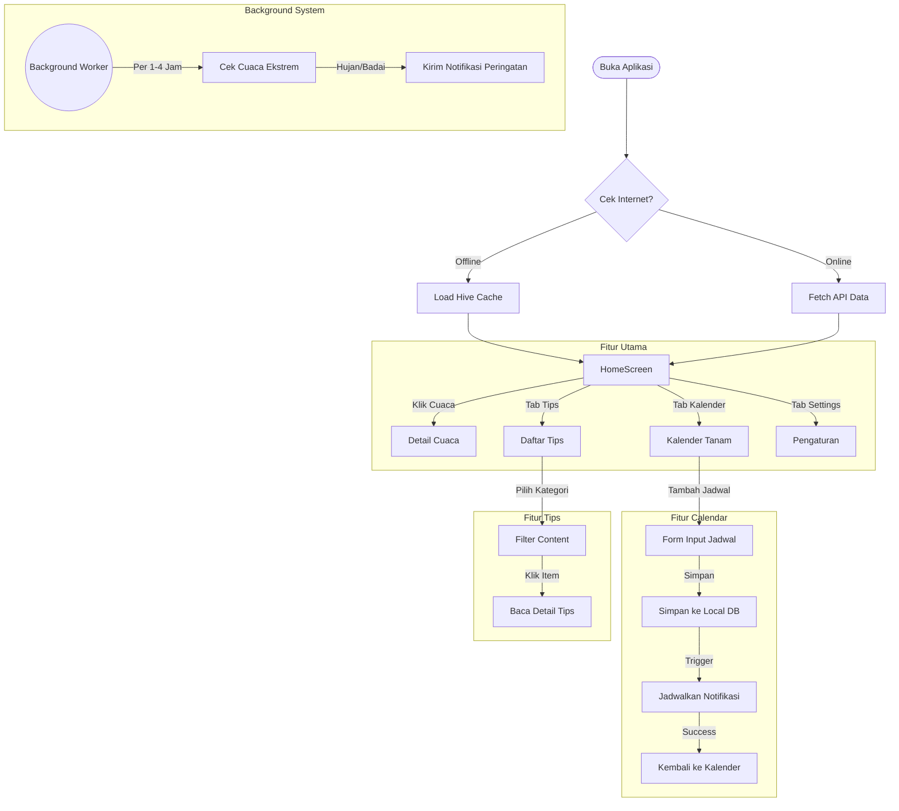
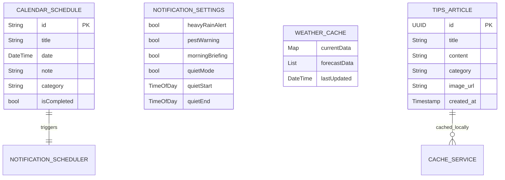

# 📑 Laporan Lengkap Pengembangan Petani Maju

Dokumen ini mencakup dokumentasi teknis, visualisasi alur kerja, struktur data, riwayat pengerjaan, dan keputusan teknis penting selama pengembangan aplikasi **Petani Maju**.

---

## 1. User Workflow Diagram (Alur Pengguna)

Diagram berikut menggambarkan alur interaksi utama pengguna di dalam aplikasi.

---

## 2. Entity Relationship Diagram (ERD) & Data Schema

Struktur data aplikasi yang menggabungkan Local Database (Hive) dan Remote Database (Supabase).

---

## 3. Log Pengerjaan Harian (Daily Progress)

Berikut adalah rekapitulasi pekerjaan berdasarkan riwayat pengembangan:

| Tanggal | Aktivitas Utama | Detail Pekerjaan |
|---------|-----------------|------------------|
| **17 Des** | **Initial Release** (v0.1.0) | Setup project, fitur dasar Cuaca, Tips, dan Navigasi. Integrasi API OpenWeather & Nominatim. |
| **20 Des** | **Optimization** | Fix bug Git push error. Implementasi Deep Learning model (Python side study). |
| **21 Des** | **Offline Mode Support** (v0.2.0) | Implementasi Hive caching agar aplikasi bisa berjalan tanpa internet. Fix app freeze saat offline. |
| **24-25 Des** | **Notification Sync** | Sinkronisasi ID notifikasi dengan ID database agar alarm bisa di-edit/cancel dengan benar. |
| **29 Des** | **UI Refinement** | Mempercantik tampilan Weather Detail (Hourly/Daily forecast widgets). Pemisahan widget ke file terpisah. |
| **30 Des** | **Calendar Bugfix** | Memperbaiki bug kritis "Calendar Stuck" setelah menambah jadwal. Menghapus fitur test notifikasi yang tidak perlu. |
| **31 Des** | **Major Refactor (BLoC)** (v0.3.0) | Migrasi total ke **Flutter BLoC**. Implementasi **Background Service**, **Quiet Mode**, dan restrukturisasi kode (Clean Architecture). Update Dokumentasi lengkap. |

---

## 4. Key Technical Decisions (Keputusan Teknis)

Berikut adalah alasan di balik pemilihan teknologi dan arsitektur kunci:

### A. State Management: **Flutter BLoC**
- **Mengapa?** Dibandingkan `setState` atau `Provider` biasa, BLoC memberikan pemisahan yang sangat tegas antara UI dan Logic.
- **Benefit:** Code lebih mudah di-test, state lebih terprediksi (finite state machine), dan sangat cocok untuk aplikasi skala menengah-besar dengan banyak event asinkron (API calls).

### B. Local Database: **Hive**
- **Mengapa?** NoSQL database yang sangat cepat (pure Dart), ringan, dan mudah digunakan dibanding SQLite/Sqflite.
- **Benefit:** Performa read/write sangat tinggi untuk caching data cuaca dan jadwal yang sering diakses. Mendukung custom objects (`TypeAdapter`).

### C. Background Service: **Workmanager**
- **Mengapa?** Membutuhkan cara untuk menjalankan kode dart (cek cuaca) bahkan saat aplikasi *terminated* (ditutup paksa).
- **Benefit:** Bisa scheduling periodic task (misal per 1 jam) yang reliable di Android.

### D. Architecture: **Feature-First**
- **Mengapa?** Struktur `lib/features/nama_fitur` lebih scalable dibanding `lib/screens`, `lib/controllers`.
- **Benefit:** Saat tim bertambah, developer bisa bekerja di fitur spesifik tanpa konflik dengan fitur lain. Kode terkait (UI, Logic, Widget) terkumpul di satu tempat.

---

## 5. Hambatan Utama & Solusi

Selama pengembangan, kami menghadapi beberapa tantangan teknis signifikan:

### Masalah 1: Calendar Stuck State
- **Gejala:** Setelah menambah jadwal, UI kalender tidak bisa diklik dan loading spinner tidak hilang.
- **Penyebab:** State `CalendarLoading` tidak pernah dikembalikan ke `CalendarLoaded` setelah operasi sukses, atau listener tidak merespon state success dengan benar.
- **Solusi:** Membuat state khusus `CalendarScheduleAdded`. Di BLoC, setelah emit success, kita secara manual emit `CalendarLoaded` kembali agar UI me-render ulang data terbaru.

### Masalah 2: Notification Ghosting (Sync Issue)
- **Gejala:** Jadwal dihapus di aplikasi, tapi alarm notifikasi tetap bunyi.
- **Penyebab:** ID notifikasi di `flutter_local_notifications` tidak sinkron dengan ID database jadwal.
- **Solusi:** Mekanisme hashing ID. Menggunakan `schedule.id.hashCode` sebagai ID notifikasi yang konsisten. Saat edit/delete, sistem menghitung hash yang sama untuk membatalkan alarm lama sebelum membuat yang baru.

### Masalah 3: Context Usage in Async Gaps
- **Gejala:** Warning linter `Do not use BuildContexts across async gaps`. Berpotensi crash jika user pindah layar saat loading.
- **Penyebab:** Mengakses `context` (untuk navigasi/snackbar) setelah `await` function.
- **Solusi:** Selalu cek `if (!context.mounted) return;` setelah proses async sebelum menggunakan context, atau pindahkan logika navigasi ke `BlocListener` yang aman.

### Masalah 4: Background Limitation
- **Gejala:** Notifikasi cuaca tidak muncul jika HP dalam mode *Doze* (tidur).
- **Solusi:** Menggunakan `Workmanager` dengan policy `ExistingPeriodicWorkPolicy.update`, dan memastikan notifikasi memiliki priority `High` agar bisa membangunkan device sejenak.

---
*Dokumen ini disusun sebagai referensi lengkap untuk arsitektur dan perjalanan pengembangan aplikasi Petani Maju.*
