# 🌾 User Flow - Aplikasi Petani Maju

Dokumentasi alur pengguna lengkap untuk aplikasi Petani Maju.

---

## 📋 Daftar Isi

- [User Flow Keseluruhan Aplikasi](#user-flow-keseluruhan-aplikasi)
- [User Flow Per Fitur](#user-flow-per-fitur)
  - [1. Onboarding](#1-onboarding)
  - [2. Home Screen](#2-home-screen)
  - [3. Fitur Cuaca](#3-fitur-cuaca)
  - [4. Fitur Kalender Tanam](#4-fitur-kalender-tanam)
  - [5. Fitur Tips Pertanian](#5-fitur-tips-pertanian)
  - [6. Fitur Hama & Penyakit](#6-fitur-hama--penyakit)
  - [7. Fitur Settings](#7-fitur-settings)
  - [8. Sistem Notifikasi](#8-sistem-notifikasi)

---

## User Flow Keseluruhan Aplikasi

Berikut adalah alur navigasi utama aplikasi dari awal hingga seluruh fitur:

```mermaid
flowchart TD
    subgraph STARTUP["🚀 Startup"]
        A([App Launch]) --> B{First Time<br/>User?}
    end

    subgraph ONBOARDING["📱 Onboarding"]
        B -->|Ya| C[Onboarding Screen]
        C --> C1[Slide 1: Cuaca Real-time]
        C1 --> C2[Slide 2: Kalender Tanam]
        C2 --> C3[Slide 3: Tips Pertanian]
        C3 --> C4[Slide 4: Notifikasi Pintar]
        C4 --> D[Mulai Aplikasi]
    end

    subgraph MAIN["🏠 Main Navigation"]
        B -->|Tidak| E[Main Screen]
        D --> E
        E --> F{Bottom Navigation}
        
        F -->|Tab 1| G[🏠 Home Screen]
        F -->|Tab 2| H[📅 Calendar Screen]
        F -->|Tab 3| I[📚 Tips Screen]
        F -->|Tab 4| J[⚙️ Settings Screen]
    end

    subgraph HOME_FEATURES["Home Features"]
        G --> G1[Weather Card]
        G --> G2[Forecast List]
        G --> G3[Weather Alert]
        G --> G4[Quick Access]
        G --> G5[Tips List]
        
        G1 -->|Tap| K[Weather Detail Screen]
        G4 -->|Hama & Penyakit| L[Pest Screen]
        G5 -->|Tap Tips| M[Tips Detail Screen]
    end

    subgraph CALENDAR_FEATURES["Calendar Features"]
        H --> H1[Kalender Bulanan]
        H --> H2[Daftar Jadwal]
        H1 -->|Pilih Tanggal| H3[Lihat Jadwal Hari Itu]
        H2 -->|Tambah| H4[Form Tambah Jadwal]
        H2 -->|Edit| H5[Form Edit Jadwal]
        H2 -->|Hapus| H6[Konfirmasi Hapus]
    end

    subgraph TIPS_FEATURES["Tips Features"]
        I --> I1[Filter Kategori]
        I --> I2[Search Tips]
        I --> I3[Daftar Tips]
        I3 -->|Tap| M
    end

    subgraph PEST_FEATURES["Pest Features"]
        L --> L1[Tab Hama]
        L --> L2[Tab Penyakit]
        L1 -->|Tap| L3[Pest Detail Screen]
        L2 -->|Tap| L3
    end

    subgraph SETTINGS_FEATURES["Settings Features"]
        J --> J1[Profile]
        J --> J2[Notifikasi]
        J --> J3[Bahasa]
        J --> J4[Bantuan]
        J --> J5[Tentang App]
        
        J1 -->|Tap| N[Profile Screen]
        J2 -->|Tap| O[Notification Settings]
        J4 -->|Tap| P[Help & Support Screen]
        J5 -->|Tap| Q[About App Screen]
    end

    style STARTUP fill:#e8f5e9,stroke:#2e7d32
    style ONBOARDING fill:#fff3e0,stroke:#ef6c00
    style MAIN fill:#e3f2fd,stroke:#1565c0
    style HOME_FEATURES fill:#fce4ec,stroke:#c2185b
    style CALENDAR_FEATURES fill:#f3e5f5,stroke:#7b1fa2
    style TIPS_FEATURES fill:#e0f2f1,stroke:#00695c
    style PEST_FEATURES fill:#fff8e1,stroke:#f57f17
    style SETTINGS_FEATURES fill:#eceff1,stroke:#455a64
```

---

## User Flow Per Fitur

### 1. Onboarding

Alur yang dilalui pengguna baru saat pertama kali membuka aplikasi:

```mermaid
flowchart TD
    A([App Launch]) --> B{Cek Status<br/>Onboarding}
    B -->|Belum Selesai| C[/"📱 Onboarding Screen"/]
    B -->|Sudah Selesai| Z[Main Screen]
    
    C --> D["Slide 1<br/>🌤️ Cuaca Real-time<br/>Pantau cuaca untuk lahan Anda"]
    D -->|Geser| E["Slide 2<br/>📅 Kalender Tanam<br/>Jadwalkan aktivitas pertanian"]
    E -->|Geser| F["Slide 3<br/>📚 Tips Pertanian<br/>Pelajari teknik budidaya"]
    F -->|Geser| G["Slide 4<br/>🔔 Notifikasi Pintar<br/>Pengingat otomatis"]
    
    G --> H{Tombol<br/>Mulai?}
    H -->|Tap Mulai| I[(Simpan Status<br/>Onboarding = done)]
    I --> Z[Main Screen]
    
    D -->|Skip| I
    E -->|Skip| I
    F -->|Skip| I

    style C fill:#fff3e0,stroke:#ef6c00
    style D fill:#e3f2fd,stroke:#1565c0
    style E fill:#f3e5f5,stroke:#7b1fa2
    style F fill:#e0f2f1,stroke:#00695c
    style G fill:#fce4ec,stroke:#c2185b
    style Z fill:#e8f5e9,stroke:#2e7d32
```

---

### 2. Home Screen

Alur interaksi pada halaman utama aplikasi:

```mermaid
flowchart TD
    A([Masuk Home Screen]) --> B{Status<br/>Koneksi?}
    
    B -->|Online| C[Load Data dari API]
    B -->|Offline| D[Load Data dari Cache]
    
    C --> E[Tampilkan UI]
    D --> F[Tampilkan Snackbar Offline]
    F --> E
    
    E --> G[/"🏠 Home Screen"/]
    
    subgraph KOMPONEN["Komponen Home Screen"]
        G --> H["☁️ Main Weather Card"]
        G --> I["📊 Forecast List<br/>(4 jam ke depan)"]
        G --> J["⚠️ Weather Alert<br/>(jika ada peringatan)"]
        G --> K["⚡ Quick Access Menu"]
        G --> L["💡 Tips Terbaru"]
    end
    
    H -->|Tap| M[Weather Detail Screen]
    H -->|Tap Refresh| N{Refresh<br/>Cuaca}
    N -->|Berhasil| O[Update UI]
    N -->|Gagal| P[Tampilkan Error]
    
    I -->|Lihat Semua| M
    
    K --> K1[🐛 Hama & Penyakit]
    K --> K2[📅 Kalender Tanam]
    
    K1 -->|Tap| Q[Pest Screen]
    K2 -->|Tap| R[Calendar Screen]
    
    L -->|Tap Item| S[Tips Detail Screen]
    L -->|Lihat Semua| T[Tips Screen]

    style G fill:#e3f2fd,stroke:#1565c0
    style H fill:#bbdefb,stroke:#1976d2
    style I fill:#c8e6c9,stroke:#388e3c
    style J fill:#ffcdd2,stroke:#d32f2f
    style K fill:#fff9c4,stroke:#f9a825
    style L fill:#d1c4e9,stroke:#512da8
```

---

### 3. Fitur Cuaca

Alur detail fitur cuaca dari home hingga detail:

```mermaid
flowchart TD
    A([Home Screen]) --> B["☁️ Main Weather Card"]
    
    B --> B1["Menampilkan:<br/>• Suhu saat ini<br/>• Kondisi cuaca<br/>• Lokasi pengguna<br/>• Icon cuaca dinamis"]
    
    B -->|Tap Card| C[/"🌤️ Weather Detail Screen"/]
    
    C --> D["Header:<br/>• Tanggal hari ini<br/>• Nama lokasi lengkap"]
    
    C --> E["Current Weather:<br/>• Suhu (°C)<br/>• Kelembaban (%)<br/>• Kecepatan Angin (km/h)<br/>• Tekanan Udara (hPa)<br/>• Visibilitas (km)"]
    
    C --> F["Hourly Forecast:<br/>• Prakiraan per jam<br/>• 24 jam ke depan<br/>• Icon & suhu tiap jam"]
    
    C --> G["Daily Forecast:<br/>• Prakiraan 5 hari<br/>• Suhu min/max<br/>• Kondisi cuaca"]
    
    C --> H["Pest Risk Analysis:<br/>• Analisis risiko hama<br/>• Berdasarkan suhu & kelembaban<br/>• Warning jika kondisi buruk"]
    
    C -->|Back| A

    style B fill:#e3f2fd,stroke:#1565c0
    style C fill:#bbdefb,stroke:#1976d2
    style E fill:#c8e6c9,stroke:#388e3c
    style F fill:#fff9c4,stroke:#f9a825
    style G fill:#d1c4e9,stroke:#512da8
    style H fill:#ffcdd2,stroke:#d32f2f
```

---

### 4. Fitur Kalender Tanam

Alur lengkap manajemen jadwal pertanian:

```mermaid
flowchart TD
    A([Tab Kalender]) --> B[/"📅 Calendar Screen"/]
    
    B --> C["📆 Kalender Bulanan<br/>(TableCalendar)"]
    B --> D["📋 Daftar Jadwal Hari Ini"]
    B --> E["💡 Rekomendasi Bulanan"]
    
    C -->|Tap Tanggal| F{Tanggal<br/>Ada Event?}
    F -->|Ya| G[Tampilkan Event<br/>di List]
    F -->|Tidak| H[List Kosong]
    
    D --> I{Aksi pada<br/>Jadwal?}
    
    I -->|Tambah Baru| J[/"➕ Form Tambah Jadwal"/]
    J --> J1["Input:<br/>• Nama Kegiatan<br/>• Tanggal & Waktu<br/>• Kategori<br/>• Catatan"]
    J1 -->|Simpan| J2[(Simpan ke Database)]
    J2 --> J3[Setup Notifikasi<br/>H-1 & H-1 Jam]
    J3 --> B
    J1 -->|Batal| B
    
    I -->|Edit| K[/"✏️ Form Edit Jadwal"/]
    K --> K1["Edit Data Jadwal"]
    K1 -->|Simpan| K2[(Update Database)]
    K2 --> K3[Update Notifikasi]
    K3 --> B
    K1 -->|Batal| B
    
    I -->|Hapus| L[/"🗑️ Dialog Konfirmasi"/]
    L -->|Ya| L1[(Hapus dari Database)]
    L1 --> L2[Cancel Notifikasi]
    L2 --> B
    L -->|Tidak| B
    
    I -->|Tandai Selesai| M[(Update Status = done)]
    M --> B

    style B fill:#f3e5f5,stroke:#7b1fa2
    style C fill:#e1bee7,stroke:#8e24aa
    style J fill:#c8e6c9,stroke:#388e3c
    style K fill:#fff9c4,stroke:#f9a825
    style L fill:#ffcdd2,stroke:#d32f2f
```

---

### 5. Fitur Tips Pertanian

Alur eksplorasi tips dari database:

```mermaid
flowchart TD
    A([Tab Tips]) --> B[/"📚 Tips Screen"/]
    
    B --> C{Status<br/>Koneksi?}
    C -->|Online| D[Fetch dari Supabase]
    C -->|Offline| E[Load dari Cache]
    
    D --> F[Simpan ke Cache]
    E --> F
    F --> G[Tampilkan Daftar Tips]
    
    subgraph FILTER["🔍 Filter & Search"]
        G --> H["Filter Kategori:<br/>• Semua<br/>• Padi<br/>• Jagung<br/>• Nutrisi"]
        G --> I["🔎 Search Bar"]
    end
    
    H -->|Pilih Kategori| J[Filter Tips<br/>by Category]
    I -->|Ketik Keyword| K[Filter Tips<br/>by Keyword]
    
    J --> L["📋 Daftar Tips<br/>(Filtered)"]
    K --> L
    
    L -->|Tap Item| M[/"📖 Tips Detail Screen"/]
    
    M --> N["Konten Detail:<br/>• Judul<br/>• Gambar Header<br/>• Kategori<br/>• Isi Artikel Lengkap"]
    
    M -->|Back| B

    style B fill:#e0f2f1,stroke:#00695c
    style H fill:#b2dfdb,stroke:#00897b
    style I fill:#c8e6c9,stroke:#388e3c
    style M fill:#a5d6a7,stroke:#43a047
```

---

### 6. Fitur Hama & Penyakit

Alur eksplorasi informasi hama dan penyakit tanaman:

---

### 7. Fitur Settings

Alur navigasi di halaman pengaturan:

```mermaid
flowchart TD
    A([Tab Settings]) --> B[/"⚙️ Settings Screen"/]
    
    subgraph MENU["Menu Settings"]
        B --> C["👤 Profil Pengguna"]
        B --> D["🔔 Pengaturan Notifikasi"]
        B --> E["🌐 Bahasa"]
        B --> F["❓ Bantuan & Dukungan"]
        B --> G["ℹ️ Tentang Aplikasi"]
    end
    
    C -->|Tap| H[/"👤 Profile Screen"/]
    H --> H1["Edit:<br/>• Nama<br/>• Foto Profil"]
    H1 -->|Simpan| H2[(Simpan ke Hive)]
    H2 --> B
    
    D -->|Tap| I[/"🔔 Notification Settings"/]
    I --> I1["Toggle:<br/>• Morning Briefing<br/>• Weather Alerts<br/>• Calendar Reminders<br/>• Quiet Mode"]
    I1 -->|Ubah Setting| I2[(Simpan Preferensi)]
    I2 --> B
    
    E -->|Tap| J{Pilih Bahasa}
    J -->|Indonesia| K[(Set Locale = id)]
    J -->|English| L[(Set Locale = en)]
    K --> B
    L --> B
    
    F -->|Tap| M[/"❓ Help & Support Screen"/]
    M --> M1["• FAQ<br/>• Kirim Email Support<br/>• Rate App"]
    M1 -->|Email| M2[Buka Email Client]
    M1 -->|Back| B
    
    G -->|Tap| N[/"ℹ️ About App Screen"/]
    N --> N1["• Versi Aplikasi<br/>• Tim Developer<br/>• Lisensi"]
    N1 -->|Back| B

    style B fill:#eceff1,stroke:#455a64
    style H fill:#e3f2fd,stroke:#1565c0
    style I fill:#fce4ec,stroke:#c2185b
    style M fill:#e8f5e9,stroke:#2e7d32
    style N fill:#fff3e0,stroke:#ef6c00
```

---

### 8. Sistem Notifikasi

Alur kerja sistem notifikasi background:

```mermaid
flowchart TD
    subgraph TRIGGERS["⏰ Trigger Sources"]
        A["⏰ Morning Briefing<br/>06:00"]
        B["📅 Calendar Event<br/>H-1, H-1 Jam, H"]
        C["⚠️ Weather Alert<br/>Real-time"]
    end
    
    subgraph BACKGROUND["🔧 Background Service"]
        A --> D{Quiet Mode<br/>Active?}
        B --> D
        C --> D
        
        D -->|"Ya 22:00-05:00"| E[Skip Notification]
        D -->|Tidak| F[Prepare Notification]
    end
    
    F --> G{Notification<br/>Type?}
    
    G -->|Morning| H["☀️ Morning Briefing<br/>Ringkasan Cuaca Hari Ini"]
    G -->|Calendar| I["📅 Calendar Reminder<br/>Pengingat Jadwal"]
    G -->|Weather| J["⚠️ Weather Alert<br/>Peringatan Cuaca Buruk"]
    
    subgraph DELIVERY["📱 Notification Delivery"]
        H --> K[Show Local Notification]
        I --> K
        J --> K
    end
    
    K --> L{User<br/>Tap?}
    L -->|Ya| M[Open App]
    L -->|Tidak| N[Dismiss]
    
    M --> O{Notification<br/>Type?}
    O -->|Weather| P[Weather Detail Screen]
    O -->|Calendar| Q[Calendar Screen]
    O -->|Morning| R[Home Screen]

    style A fill:#fff9c4,stroke:#f9a825
    style B fill:#c8e6c9,stroke:#388e3c
    style C fill:#ffcdd2,stroke:#d32f2f
    style K fill:#e3f2fd,stroke:#1565c0
```

---

## 📊 Ringkasan Navigasi

| Screen | Cara Akses | Fitur Utama |
|--------|------------|-------------|
| **Home** | Bottom Nav Tab 1 | Weather, Forecast, Quick Access, Tips |
| **Calendar** | Bottom Nav Tab 2 / Quick Access | Jadwal Tanam, CRUD Event |
| **Tips** | Bottom Nav Tab 3 / Home Tips | Filter, Search, Detail Article |
| **Settings** | Bottom Nav Tab 4 | Profile, Notif, Language, Help |
| **Weather Detail** | Tap Weather Card | Full Forecast, Pest Risk |
| **Pest Screen** | Quick Access | Hama & Penyakit Info |
| **Onboarding** | First Launch Only | App Introduction |

---

*Dokumentasi ini dibuat untuk presentasi aplikasi Petani Maju*
